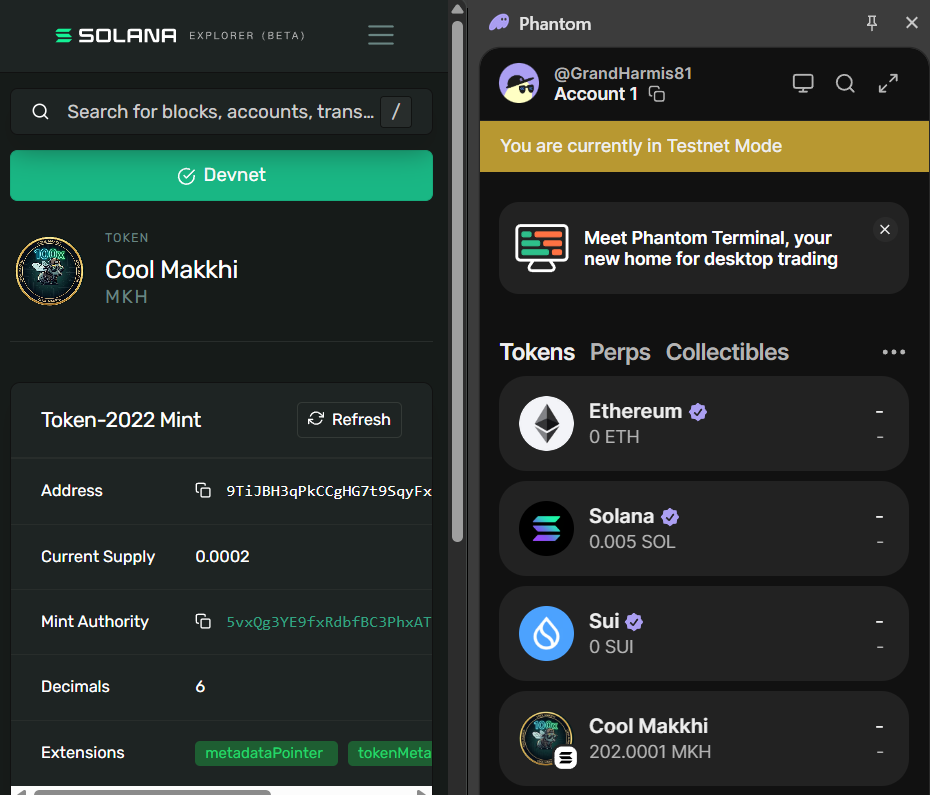
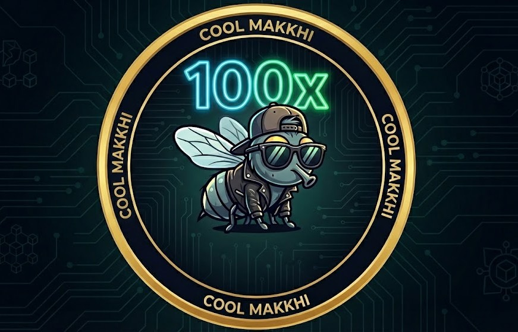

# Solana SPL Token Demo

This project demonstrates the creation, minting, and transferring of SPL tokens on the Solana blockchain. It supports both the Legacy Token Program and the newer Token-2022 Program, including metadata extensions.

## Project Overview

The primary focus of this demo is the Cool Makkhi (MKH) token. The repository provides a series of TypeScript scripts to interact with the Solana network (Devnet/Testnet) using the @solana/web3.js and @solana/spl-token libraries.

## Features

- Create Legacy SPL tokens.
- Create Token-2022 tokens with metadata pointers and inline metadata.
- Mint tokens to associated token accounts.
- Transfer tokens between accounts for both program versions.
- Automatic handling of rent exemption and associated token account creation.

## Prerequisites

- Node.js installed on your machine.
- An active Solana wallet with Devnet/Testnet SOL (for transaction fees).

## Installation

Install the project dependencies using npm:

```bash
npm install
```

## Running the Demo

The project is configured to run using tsx for direct TypeScript execution. To execute the main script:

```bash
npm run dev
```

You can modify index.ts to toggle between different operations such as minting legacy tokens or transferring Token-2022 assets.

## Project Structure

- connection.ts: Initializes the Solana connection.
- constants.ts: Stores shared public keys and keypairs for the demo.
- createMintForToken.ts: Logic for creating a Legacy SPL token mint.
- createTokenWithMetaData.ts: Logic for creating a Token-2022 mint with metadata.
- mintToken.ts: Generic function to mint tokens (supports both programs).
- transferToken.ts: Generic function to transfer tokens (supports both programs).
- index.ts: The entry point for executing demo scenarios.

## Proof of Work

The following image shows a successful token creation and the resulting metadata as seen in the Solana Explorer and Phantom wallet.



## Token Identity


